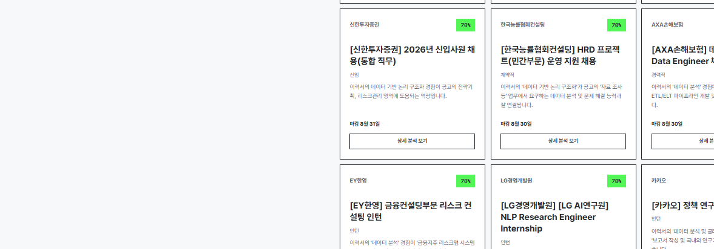
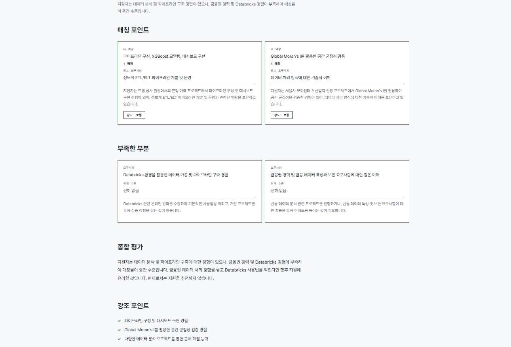

# 역량 기반 채용공고 매칭 서비스

직무 타이틀이 아니라 **공고 원문(JD)의 요구 역량과 내 이력서의 역량을 AI로 대조**해서, 링커리어에서 수집한 인턴/채용 공고 중 나에게 맞는 공고를 찾아주는 서비스입니다.

## 🔗 서비스 바로가기

**[https://nynji.dx6project.site/](https://nynji.dx6project.site/)**

> 별도 회원가입 없이 이력서를 업로드하면 바로 매칭을 시작할 수 있습니다.
> 업로드한 이력서는 브라우저 세션에만 저장되며 서버에 계정 정보가 남지 않습니다.

## 프로젝트 구조

```
project-root/
  backend/               # FastAPI (공고 조회 · 이력서 업로드 · 매칭 API)
  frontend/              # React + TypeScript (Vite)
  crawler/               # 링커리어 크롤러 (GitHub Actions cron으로 실행)
  .github/workflows/     # crawl.yml — 하루 3회 자동 크롤링
  design.md              # 프론트 디자인 시스템 레퍼런스
```

## 기술 스택

- **Frontend**: React 19 + TypeScript + Vite (별도 HTTP 클라이언트 없이 `fetch` 사용)
- **Backend**: Python + FastAPI + SQLAlchemy
- **DB**: Supabase (PostgreSQL)
- **AI**: OpenAI API (GPT-4o) — 이력서/공고 역량 추출, 매칭 점수·이유 산정, PDF OCR, 심층 분석
- **Crawler**: Playwright + GitHub Actions cron
- **문서 처리**: pypdfium2(PDF 텍스트 레이어+OCR), openpyxl(엑셀), python-docx(워드)


## 주요 기능

### 공고 목록 / 상세
- 마감 임박순 · 최신 수집순 정렬, 마감 지난 공고는 자동으로 숨김
- 상세 페이지에 원문 텍스트 + 이미지(이미지형 공고), 자소서 문항, 제출사항 표시

### 이력서 업로드 & AI 역량 추출
- PDF / 워드(.docx) / 엑셀(.xlsx) / 텍스트(.txt/.md) 여러 개를 한 번에 업로드하거나, 텍스트를 직접 붙여넣기 가능
- GPT-4o가 역량(`skill_name` / `competency` / `evidence`)을 구조화 추출
- 로그인 기능은 없고, 업로드한 이력서는 **브라우저 세션(sessionStorage)에만 연결**됩니다 — 같은 서비스를 쓰는 다른 사람의 이력서나 매칭 결과를 볼 수 없고, 새로 올리면 세션의 이력서가 교체됩니다.

### 공고 매칭
- 이력서와 전 공고 세부직무(`posting_role`)를 GPT-4o가 배치로 비교해 0~100점 + 이유 문장을 생성합니다 (문자열 완전일치가 아니라 의미 기반 추론).
- 상위 30건을 매칭률 내림차순으로 보여주고, 카드에 매칭 이유가 바로 표시됩니다.
- 공고별 "상세 분석 보기"를 누르면 매칭 포인트 / 부족한 부분 / 종합 평가 / 강조 포인트를 다시 GPT-4o로 심층 생성하고 캐시합니다(같은 이력서·공고 조합은 재계산 없이 즉시 반환).




## 실행 방법

> 서비스를 **직접 사용**하려면 → [https://nynji.dx6project.site/](https://nynji.dx6project.site/)
> 아래는 **로컬 개발 환경** 설정 방법입니다.

### Backend

```bash
cd backend
pip install -r requirements.txt
cp .env.example .env   # DATABASE_URL / OPENAI_API_KEY 등 채우기
uvicorn app.main:app --reload --port 8000
```

- API: http://localhost:8000
- Health check: http://localhost:8000/health
- `DATABASE_URL`은 Supabase Postgres 접속 문자열입니다. 이 네트워크가 IPv6를 지원하지 않으면 다이렉트 접속(`db.<project>.supabase.co`)이 실패할 수 있으니, Supabase 대시보드의 **Connection pooling(Session pooler)** 주소를 사용하세요.

### Frontend

```bash
cd frontend
npm install
cp .env.example .env   # VITE_API_URL (기본 http://localhost:8000)
npm run dev
```

- 앱: http://localhost:5173
- 빌드 확인: `npm run build` (`tsc -b && vite build`)

### Crawler

```bash
cd crawler
pip install -r requirements.txt
playwright install --with-deps chromium
cp .env.example .env   # SUPABASE_URL / SUPABASE_SERVICE_ROLE_KEY / OPENAI_API_KEY
python run.py
```

- 링커리어 **채용**·**인턴** 두 목록을 각각 최대 `CRAWL_MAX_PAGES`(기본 10)페이지까지 `page=N` 쿼리파라미터로 직접 순회하며 수집합니다 (목록 URL은 `LINKAREER_RECRUIT_URL` / `LINKAREER_INTERN_URL`로 재정의 가능).
- 상세 페이지의 "상세내용" 탭 영역(`article#DETAIL .responsive-element`)만 정확히 읽어서, 채팅방·스터디모집·합격후기·추천공고 같은 주변 잡음은 수집하지 않습니다.
- PDF/이미지가 아니라 텍스트가 있는 공고는 텍스트를 그대로 저장하고, 텍스트가 200자 미만이면서 이미지가 있는(스캔형) 공고만 GPT-4o Vision으로 OCR합니다.
- 이미 저장된 공고(`linkareer_url` 기준)는 이번 수집 내용으로 **덮어써서 갱신**합니다(건너뛰지 않음).
- GitHub Actions는 UTC 기준이라 `crawl.yml`은 한국 시간 07:00 / 14:00 / 19:00에 실행됩니다. 저장소 **Settings → Secrets and variables → Actions**에 `SUPABASE_URL`, `SUPABASE_SERVICE_ROLE_KEY`, `OPENAI_API_KEY`를 등록해야 스케줄 실행이 정상 동작합니다.

## 환경변수

| 파일 | 변수 | 설명 |
|---|---|---|
| `backend/.env` | `DATABASE_URL` | Supabase Postgres 접속 문자열 (pooler 권장) |
| | `OPENAI_API_KEY` | 역량 추출 / 매칭 / OCR / 분석에 공용 사용 |
| `frontend/.env` | `VITE_API_URL` | 백엔드 API 주소 (기본 `http://localhost:8000`) |
| `crawler/.env` | `SUPABASE_URL`, `SUPABASE_SERVICE_ROLE_KEY` | Supabase REST API 접속 (크롤러는 SQLAlchemy가 아니라 `supabase-py` 클라이언트로 직접 적재) |
| | `OPENAI_API_KEY` | 산업분류 추출, 스캔형 공고 OCR |
| | `LINKAREER_RECRUIT_URL` / `LINKAREER_INTERN_URL` / `CRAWL_MAX_PAGES` | 선택. 크롤링 대상 목록/페이지 수 재정의 |

## 데이터베이스 스키마

`job_posting` 계열과 `match_analysis`, 그리고 (더 이상 쓰지 않는) `resume` 테이블은 이 저장소의 SQL로 만들 수 있습니다. Supabase Dashboard → SQL Editor에서 순서대로 실행하세요.

1. [`crawler/schema.sql`](crawler/schema.sql) — `job_posting` 컬럼, `submission_requirement`, `cover_letter_question`
2. [`backend/schema.sql`](backend/schema.sql) — `match_analysis`, `application.match_reason`

이력서/역량/매칭 관련 테이블(`member`, `member_resume`, `member_skill`, `posting_role`, `posting_skill`, `application`)은 이 저장소에 생성 스크립트가 없고 Supabase 프로젝트에 이미 만들어져 있어야 합니다. 새로 만든다면 대략 아래 구조입니다:

```sql
create table public.member (
  id bigint generated by default as identity primary key,
  email text, name text, created_at timestamptz default now()
);
create table public.member_resume (
  id bigint generated by default as identity primary key,
  member_id bigint not null references public.member(id) on delete cascade,
  title text, raw_text text, created_at timestamptz default now()
);
create table public.member_skill (
  id bigint generated by default as identity primary key,
  resume_id bigint not null references public.member_resume(id) on delete cascade,
  skill_name text, competency text, evidence text, created_at timestamptz default now()
);
create table public.posting_role (
  id bigint generated by default as identity primary key,
  posting_id bigint not null references public.job_posting(id) on delete cascade,
  role_name text, experience text, role_order integer, created_at timestamptz default now()
);
create table public.posting_skill (
  id bigint generated by default as identity primary key,
  role_id bigint not null references public.posting_role(id) on delete cascade,
  skill_name text, competency text, importance text
);
create table public.application (
  id bigint generated by default as identity primary key,
  member_id bigint not null references public.member(id) on delete cascade,
  role_id bigint not null references public.posting_role(id) on delete cascade,
  resume_id bigint references public.member_resume(id),
  status text, match_score integer, match_reason text, created_at timestamptz default now()
);
```

## API 개요

| Method | Path | 설명 |
|---|---|---|
| GET | `/postings` | 공고 목록 (페이지네이션, `order_by=collected_at\|deadline`) |
| GET | `/postings/count` | 전체 공고 수 |
| GET | `/postings/{id}` | 공고 상세 |
| POST | `/postings/roles/extract-skills` | `posting_skill`이 비어있는 세부직무에 GPT-4o로 요구역량 백필 |
| POST | `/resumes` | 이력서 파일(복수)/텍스트 업로드 → 역량 추출 |
| GET | `/resumes/{id}/skills` | 추출된 역량 조회 |
| POST | `/resumes/{id}/match` | 전체 공고 재매칭 실행 후 저장 |
| GET | `/resumes/{id}/matches` | 저장된 매칭 결과 조회 |
| POST | `/matches/analyze` | 특정 공고 심층 분석 (캐시 있으면 즉시 반환, `force=true`로 재분석) |
| GET | `/matches/analysis` | 저장된 심층 분석 조회 |

## 제한 사항

- "자소서 초안 생성" 버튼은 화면에는 있지만 해당 기능은 아직 구현되어 있지 않습니다.
